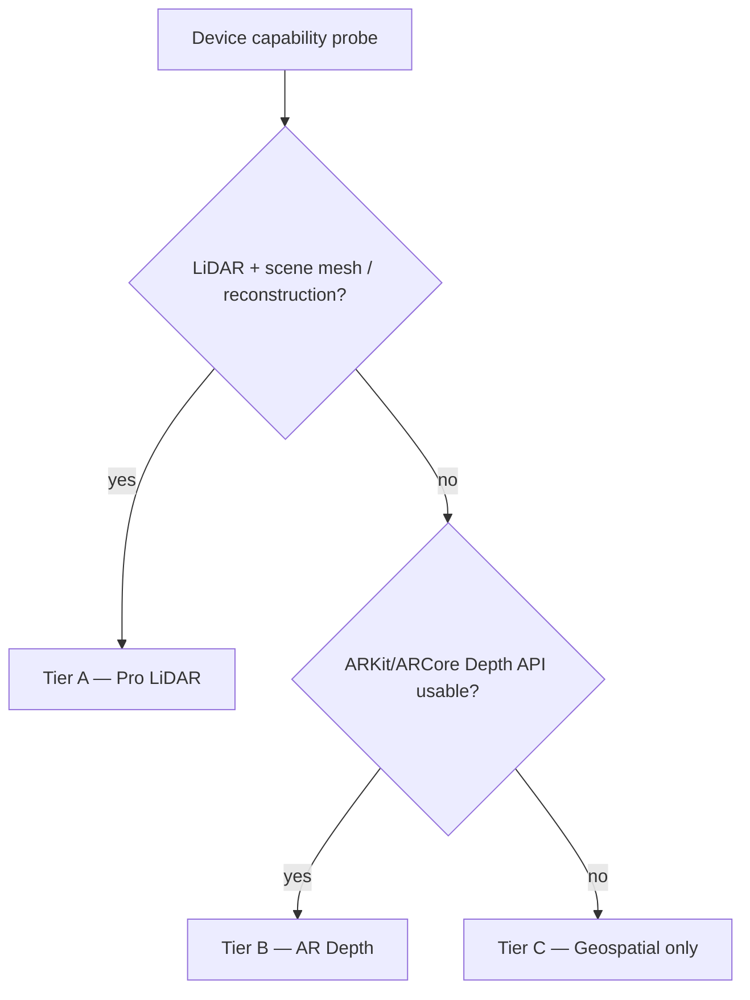
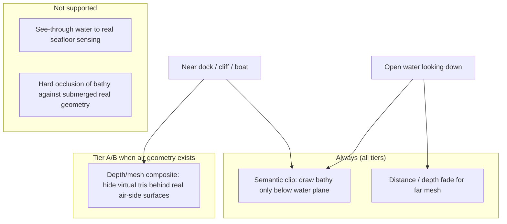
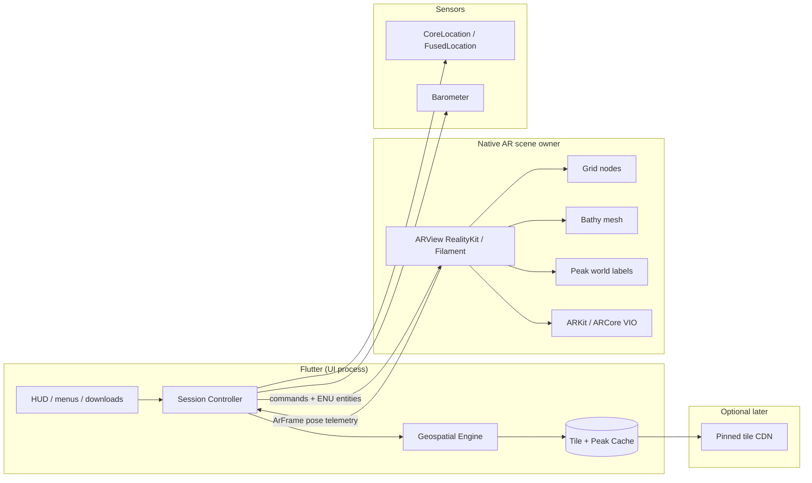
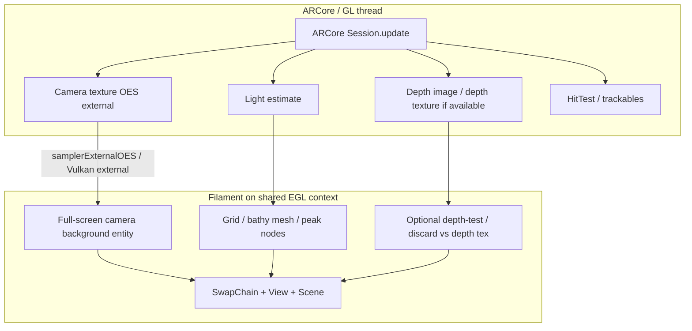
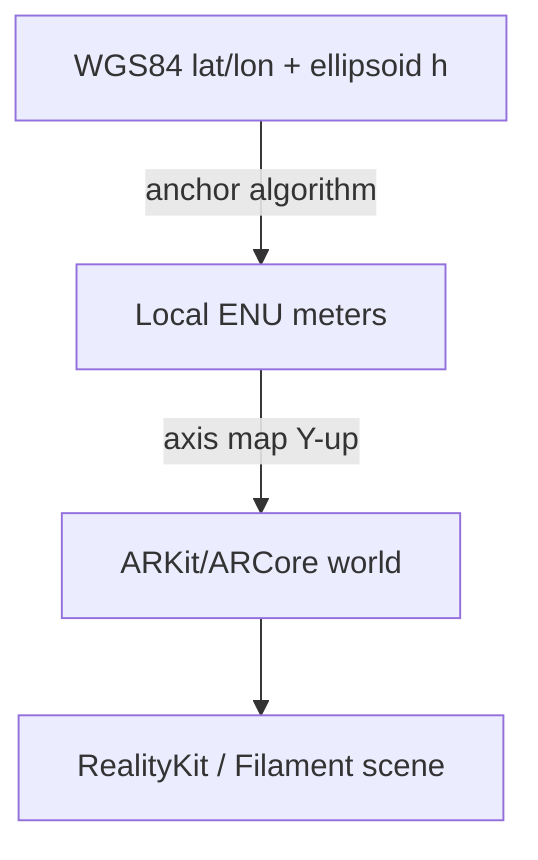
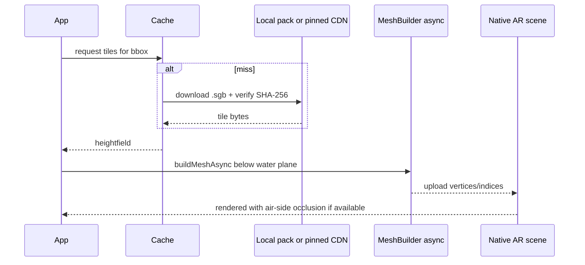
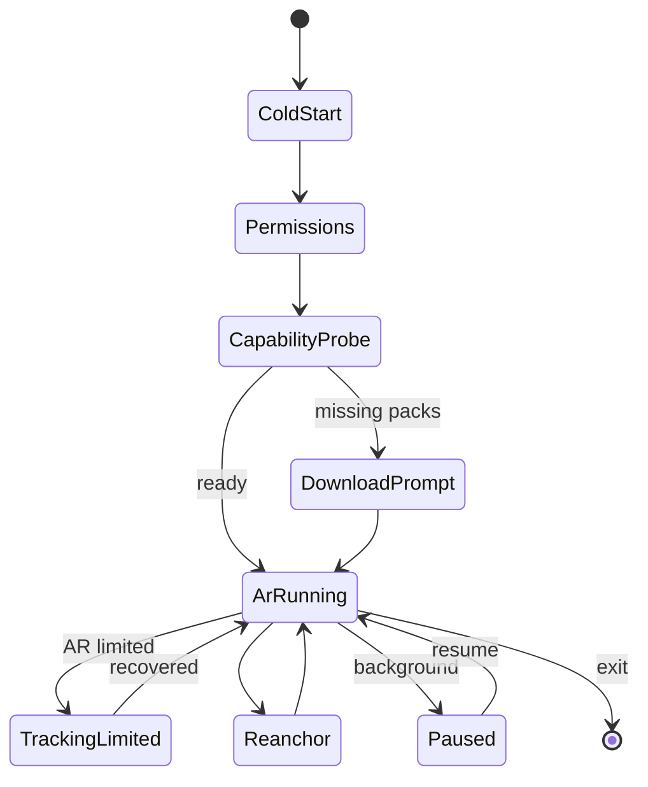
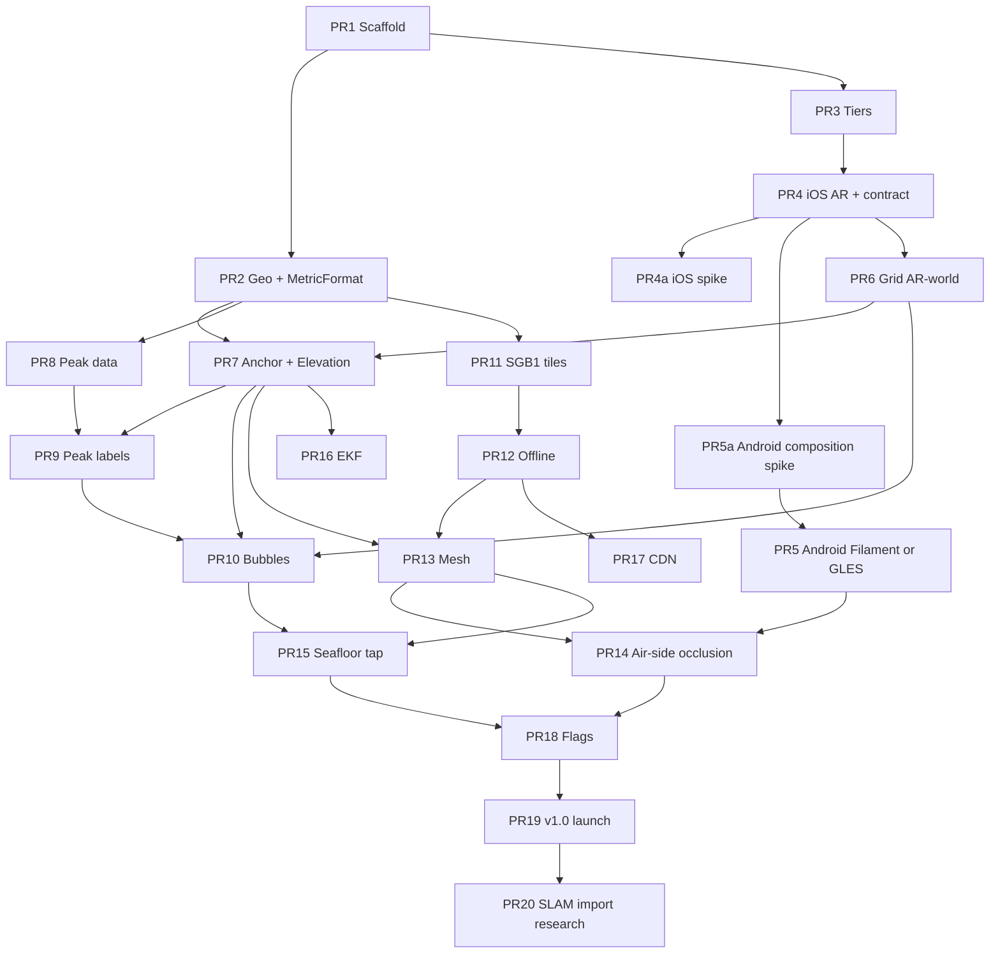

# SeaGrid AR — Design Document

| Field | Value |
|-------|--------|
| **Title** | SeaGrid AR: Mobile AR Grid for Bathymetry, Terrain & Navigation |
| **Author** | SeaGrid AR maintainers (placeholder until first committers assigned) |
| **Date** | 2026-07-27 |
| **Status** | Draft (Rev 3 — post re-review) |
| **License** | Apache-2.0 (app code); third-party data under their own terms |
| **Repo** | Greenfield public GitHub repository (proposed name: `seagrid-ar`) |
| **Stack** | Flutter 3.22+ (iOS 16+ / Android API 28+), native AR scene (RealityKit + Filament), Riverpod |
| **Disclaimer status** | Draft navigational disclaimer — **needs legal review before store submit (PR 19)** |

---

## Overview

SeaGrid AR is a greenfield Flutter mobile application that places a clean, metric 3D grid and geospatial labels on the live camera feed. On the surface it supports travel distance estimation, mountain peak labels (name + elevation), and approximate height above sea level. Over water or for dive/fishing **planning** it visualizes a **coarse** underwater bathymetry mesh (primarily GEBCO-scale resolution), and allows tap-to-inspect bubbles (name, depth/height, distance).

**Occlusion is air-side only:** LiDAR and mobile depth APIs sense geometry in air (piers, boats, cliffs, shoreline), not the seafloor through water. Underwater mesh is always **semantically clipped** to the water plane; hard/soft occlusion only prevents drawing *through* real above-water objects near shore or structures. This is not “AR X-ray of the seafloor.”

The product cannot naively ship full desktop SLAM stacks (ORB-SLAM3, RTAB-Map, Cartographer) on-device. This design defines **capability tiers**, a **hybrid localization stack** (platform VIO + optional LiDAR mesh + GPS/altitude fusion + optional cloud/edge assist for heavy mapping), and a **tile-based geospatial pipeline** for GEBCO-class bathymetry and peak datasets. The result is an implementable Flutter monorepo structure and a phased PR plan suitable for a new public GitHub repository.

---

## Background & Motivation

### Problem

Fishers, divers, and coastal travelers lack a simple, live AR view that answers:

1. **What is the approximate chart-scale depth under/near me?** (coarse bathymetry context—not wreck-level precision)
2. **How high am I (approx. above sea level), and what peaks am I looking at?** (display orthometric height + labeled summits)
3. **How far is that point?** (horizontal surface travel distance; optional slant range in Dive plan)
4. **What does the seafloor look like as a 3D planning mesh relative to sea level?** (water-plane-clipped mesh; air-side occlusion only near structures/shore)

Existing tools (Navionics, Google Earth, PeakFinder-class apps) are either 2D charts, offline peak finders without underwater meshes, or desktop GIS—not a unified AR overlay with a metric grid.

### Current state (greenfield)

There is no existing codebase. Design assumes a new public repo with:

- Flutter app shell (UI, settings, offline downloads)
- **Native AR scene ownership** (camera, grid, bathy mesh, peak world nodes)
- Offline-first geospatial tile cache
- Optional lightweight backend for tile CDN (not required for MVP)

### Pain points this design addresses

| Pain | Mitigation |
|------|------------|
| Desktop SLAM too heavy for phones | Capability tiers; platform VIO as primary; SLAM algorithms as research/edge import modules, not v1 runtime deps |
| LiDAR only on some devices | Tier A (LiDAR), B (AR depth), C (GPS+IMU only) with graceful degradation |
| Bathymetry datasets are multi-GB | Regional tile packaging, on-demand download, quantized heightfields with scale+offset |
| AR “occlusion” mis-sold over open water | Semantic water-plane clip always; air-side depth composite only for structures/land |
| Cross-platform AR API fragmentation | `seagrid_ar_interface` + native RealityKit (iOS) / Filament (Android) scene owners |
| Vertical datum confusion | Closed policy: ellipsoid internal, EGM96 orthometric for display, GEBCO datum for bathy with badges |

---

## Goals & Non-Goals

### Goals

1. **AR metric grid overlay** on live camera: local AR-world or ENU-aligned meters, configurable spacing (1 / 5 / 10 / 25 m).
2. **Approximate height above sea level** displayed continuously as **user-facing “Elevation ≈ X m”** (display orthometric ≈ \(h - N_{\mathrm{EGM96}}\)), with mandatory uncertainty when vertical σ is large.
3. **Mountain peak labels**: name + integer elevation (m) for peaks in FOV / radius, with screen-space projection and decluttering.
4. **Underwater terrain visualization**: bathymetric mesh **below the water plane**, with **air-side** occlusion against real-world depth/mesh when hardware supports it (piers, boats, land). Always show **data resolution** in UX.
5. **Tap info bubble**: feature name, depth or height (m), horizontal distance (m/km), data source badge.
6. **Purpose-fit UX** for fishing/diving **planning context** and surface travel distances—clean AR UI, metric-only in v1. No “precision depth” marketing copy.
7. **Realistic platform support**: iOS primary for LiDAR (Tier A); Android for ARCore Depth where available (Tier B); Tier C geospatial mode elsewhere.
8. **Offline-capable core**: after tile/peak pack download, AR session works without network for grid, cached bathymetry, and cached peaks.
9. **Public-repo readiness**: Apache-2.0 app code; clear attribution for GeoNames, GEBCO, etc.
10. **Phased delivery**: shippable **iOS-first MVP** (grid + elevation + peaks + bubbles); bathymetry mesh behind feature flag until resolution UX is solid.

### Non-Goals

1. **Not** a certified nautical chart product or ECDIS replacement; not for navigation safety-critical use (disclaimer; **legal review before store**).
2. **Not** running full ORB-SLAM3 / RTAB-Map / Cartographer as the default on-device tracking loop in v1.
3. **Not** multiplayer shared AR world or social features in v1.
4. **Not** imperial units in v1 (metric only).
5. **Not** real-time multibeam sonar ingestion in v1.
6. **Not** full 3D city/building mesh reconstruction product.
7. **Not** supporting devices without a rear camera + basic motion sensors.
8. **Not** guaranteeing sub-meter absolute geodetic accuracy without RTK/external GNSS.
9. **Not** imaging or sensing the seafloor through water with phone LiDAR/depth (physically impossible for this stack).
10. **Not** live tide-corrected depths in v1.

---

## Key Decisions

| # | Decision | Rationale |
|---|----------|-----------|
| KD-1 | **Flutter as single client** for UI/product; **native AR scene owns** camera, grid, bathy mesh, peak world nodes | One product surface; world-locked geometry must not depend on late Dart poses (PlatformView jank). Flutter: menus, settings, downloads, HUD chrome. |
| KD-2 | **Capability tiers (A/B/C)** instead of one-size-fits-all | LiDAR and depth APIs are not universal; product must degrade gracefully. |
| KD-3 | **Platform VIO (ARKit/ARCore) as primary tracking**; full ORB-SLAM3/RTAB-Map/Cartographer only as offline/edge **import** | Mobile AR frameworks already fuse IMU+vision; desktop SLAM is thermal/CPU hostile on phones. |
| KD-4 | **Tile-based bathymetry (GEBCO baseline)**; regional higher-res **Phase 2 pending license review** | Global grids are multi-GB; tiles enable progressive download. NOAA/regional not v1 priority until OQ-legal clears. |
| KD-5 | **Peak catalog from GeoNames** + offline DEM enrichment for missing elevations | Open, attributable; elevations cross-checked at build time. |
| KD-6 | **Local ENU for geospatial placement**, AR world for rendering; explicit AR↔ENU anchor algorithm (see below) | Stable meters + standard geospatial sources. |
| KD-7 | **Water plane = orthometric 0** (EGM96 display path) + `waterLevelOffsetM`; mesh clip uses **source heights treated as approx. same zero** (no per-cell geoid on bathy v1) | Simple separator; residual GEBCO↔EGM96 error ≪ cell size; planning on land allowed. |
| KD-8 | **No heavy cloud requirement for MVP**; optional CDN later with pinned host + SHA-256 manifests | Offline-first for boats/coasts. |
| KD-9 | **Feature flags + tier gating** for rollout | Ship incomplete sensors safely. |
| KD-10 | **Monorepo**: `apps/seagrid`, `packages/*`, `native/*`, `docs/`, `tools/` | Clear boundaries; testable pure-Dart packages. |
| KD-11 | **Native renderers: RealityKit (iOS) + Filament (Android)**; pub.dev AR plugins optional bootstrap only. Android composition per **Android rendering annex**; **GLES fallback** if Filament+ARCore exceeds budget | Scene graph ownership for mesh/labels; avoid Sceneform; Filament is not turnkey AR—must own camera/depth composition (see annex). |
| KD-12 | **Vertical datum policy**: store GNSS **ellipsoid** \(h\); **display** orthometric \(H \approx h - N_{\mathrm{EGM96}}\); bathy samples in **source vertical datum** (GEBCO as documented) with always-on source/resolution badge; **no live tides in v1** | Closes HAE/MSL/depth mix; honest UX. |
| KD-13 | **Bathy tile encoding**: int16 payload + per-tile `scale` + `offset` (`height_m = offset + value * scale`), nodata sentinel, optional zstd | Covers ≈ −11 km…+9 km; smaller than float32; round-trip tests mandatory. |
| KD-14 | **Bathy tile CRS**: **geographic (EPSG:4326) regular grid** tiles, not WebMercator | Avoids high-latitude mercator distortion for depth sampling. |
| KD-15 | **Grid yaw default**: true north from **GNSS course-over-ground when speed > 1 m/s**; else gyro-propagated from last good heading; magnetometer **optional**, **off in Marine profile** | Boats corrupt magnetometers; COG is more reliable when moving. |
| KD-16 | **Air-side occlusion only** for virtual content vs real geometry; open-water bathy uses water-plane clip + distance fade | Matches sensor physics; prevents false product expectations. |
| KD-17 | **State management: Riverpod**; DI via Riverpod providers (not dual get_it + Riverpod) | Single pattern for a greenfield app. |
| KD-18 | **License: Apache-2.0** for app/packages | Patent grant clarity for public repo contributors. |
| KD-19 | **Min platforms: iOS 16+, Android API 28 (Android 9)+**, ARCore as available | RealityKit depth/mesh features; reasonable ARCore base. |
| KD-20 | **Custom ENU anchor for MVP**; Google Geospatial API / Apple GeoAnchors **out of MVP** (optional later enhancers) | Offline parity iOS/Android; less vendor lock-in. |
| KD-21 | **Metric formatting**: single `MetricFormat` API (see Metric units); distance default = **horizontal**; slant only in Dive plan | Implementable contract; no locale unit systems. |
| KD-22 | **User-facing altitude label**: “Elevation ≈ X m” + “above sea level (approx.)”; never show “HAE” in UI | HAE remains developer/log terminology only. |

---

## Proposed Design

### Product name & positioning

**SeaGrid AR** — “Metric AR grid for coast, peaks, and depth context.”

Disclaimer on first launch (draft — **needs legal review before store submit**):

> *Not for navigational safety. Bathymetry is coarse (often ~450 m cells for global GEBCO) and not tide-corrected. Depth and elevation are approximate. Always use official charts and local knowledge.*

### Capability tiers

Probe algorithm (pick **best available**, exclusive):



| Tier | Hardware (examples) | Tracking | Occlusion role | Bathymetry AR quality |
|------|---------------------|----------|----------------|------------------------|
| **A** | iPhone 12–16 Pro / Pro Max, iPad Pro (LiDAR) | ARKit world tracking + mesh | **Air-side** hard occlusion vs scene mesh/depth (docks, boats, cliffs) | Medium–high **near shore/structures**; open water = water-plane clip + fade only |
| **B** | Recent iPhones without LiDAR; Android ARCore Depth devices | ARKit / ARCore VIO | Soft air-side depth composite where API exists | Medium near structures; same open-water limits |
| **C** | Older phones with GPS + camera | GPS + IMU orientation; camera as background | None | Low: horizon-aligned / screen planning view; labels + coarse mesh optional in mini-map |

**Tier detection** at startup via platform channels:

- iOS: `supportsSceneReconstruction(.mesh)`, LiDAR presence, `ARConfiguration.isSupported`, depth data formats
- Android: ARCore availability, Depth API support

### Occlusion semantics (critical product truth)



| Scenario | What user sees |
|----------|----------------|
| Open water, mid-bay | Translucent seafloor mesh under water plane; **no** LiDAR seafloor lock; resolution chip e.g. “~450 m cells” |
| Looking at pier piles | Mesh/grid **does not draw through** pier (air-side occlusion) |
| On land, Dive plan / Coastal mode | Planning preview of offshore bathy in ENU; water plane at orthometric 0 |

### High-level architecture



**Pose sync rule:** World-locked content (grid, mesh, peak anchors) is placed and updated **on the native render thread** using ARKit/ARCore frame timestamps. Flutter receives `ArFrame` telemetry for HUD (elevation chip, accuracy) at ≤ display rate; Flutter must **not** be the sole authority for world poses of 3D content.

### Android rendering annex (ARCore + Filament)

RealityKit/`ARView` is relatively turnkey on iOS. **Filament does not wrap ARCore.** Android must compose camera, tracking, depth, and the Filament scene graph explicitly. This annex is normative for PR 5 / PR 5a.

#### Recommended composition (primary path)



| Concern | Approach |
|---------|----------|
| **Session** | Own `com.google.ar.core.Session` in `seagrid_ar_arcore` (Kotlin/C++); do not rely on abandoned Sceneform. |
| **GL/EGL** | Create **shared EGL context** (or GL thread affinity required by ARCore). Filament `Engine` / `SwapChain` created on that context. Prefer OpenGL ES path first (widest ARCore docs); Vulkan optional later if Filament + ARCore external memory is proven in spike. |
| **Camera background** | Each frame after `Session.update`: bind camera texture ID from ARCore → Filament material using external sampler → full-screen quad (or `RenderableManager` background) with UVs from `Frame.transformDisplayUvCoords`. |
| **Camera pose** | Read `camera.displayOrientedPose` (or view matrix) → set Filament camera model/view to match ARCore (Y-up consistency with iOS axis map in `seagrid_geo`). |
| **Projection** | Use ARCore projection matrix for near/far matching depth; do not invent a second projection. |
| **Depth / occlusion** | If Depth API available: acquire depth image → upload R16/float texture → fragment discard or soft composite for air-side occlusion (same semantics as iOS Tier B). If unavailable → depth-test only among virtual content + water-plane clip. |
| **Hit-test** | ARCore `Frame.hitTest` for feature points / planes; bathy mesh raycast remains in app/engine code (same as iOS). |
| **Lighting** | ARCore light estimate → Filament indirect light / directional intensity (best-effort). |
| **Threading** | All ARCore + Filament draw calls on the **AR/GL thread**. Dart method-channel results posted to main isolate; mesh uploads marshaled onto GL thread via queue. Never call `Session.update` from a random worker. |
| **Lifecycle** | `onResume`/`onPause`: pause session + Filament rendering; re-create textures after context loss. |
| **Flutter embedding** | `PlatformView` (`AndroidView`) hosting `SurfaceView`/`TextureView` owned by native AR module; Flutter HUD overlays as sibling widgets. |

#### Fallback if Filament integration slips (go/no-go)

| Criterion | Go (Filament) | No-go → fallback |
|-----------|---------------|------------------|
| Camera background + pose locked within spike | Stable 30 fps on mid-tier ARCore device | — |
| Grid + 10k-tri mesh + labels | Within PR 5 **L** budget | **Minimal custom GLES renderer** implementing the same `ArSession` entity APIs (`setGrid`, `setBathyMesh`, `setPeakNodes`) |
| Depth texture sample | Optional for Tier B | Soft-skip occlusion; keep water-plane clip |

Fallback is **not** Sceneform. It is a thin GLES scene graph behind the same `seagrid_ar_interface` contract so iOS/Android Dart code stays unchanged. Spike records the decision in `docs/architecture.md`.

#### Relationship to spikes

- **PR 4a:** iOS PlatformView / native peak-node jank (as before).  
- **PR 5a:** Android ARCore camera→Filament (or GLES) composition spike with the go/no-go table above.

### Localization & sensor fusion

#### v1 AR ↔ ENU anchor algorithm (normative)

**Internal origin height:** `GeodeticAnchor.originHeightM` is **ellipsoid height** \(h\) (WGS84). Display orthometric is computed separately (KD-12).

**Phase A — Cold origin (t = 0)**

1. Wait until AR tracking state = `normal` (not limited/unavailable).
2. Accept first GNSS fix with `horizontalAccuracy ≤ 20 m` (configurable 15–25 m). If none within 30 s, use best fix and set UI **“Alignment degraded”**.
3. Set ENU origin at \((\phi_0, \lambda_0, h_0)\).
4. Set initial yaw:
   - If speed ≥ 1 m/s and COG valid → true-north from COG.
   - Else if Marine profile **off** and magnetometer calibrated → magnetic→true using **World Magnetic Model (WMM)** coefficients bundled for a declared epoch (e.g. WMM2025; ship `wmm_coeff` year in assets; refresh when NOAA publishes a new model—or use platform true-heading APIs when they already apply WMM). Prefer platform true heading when available and documented as WMM-corrected.
   - Else → identity yaw relative to AR world; mark **heading uncertain**.
5. Translation: map current AR camera horizontal position to ENU (0,0) at origin; vertical: align AR Y-up to ENU up with measured pitch/roll from gravity.

**Phase B — Translation-only tracking updates**

- While user travels < 15 m cumulative from origin: **do not** re-estimate yaw from GNSS (yaw unobservable when stationary / short baseline).
- Low-pass GNSS position (e.g. α-β or **first-order exponential smoother**, configurable α) to nudge ENU↔AR translation when `horizontalAccuracy ≤ 15 m` and AR tracking = `normal`.
- Reject samples when tracking ∈ {`limited`, `relocalizing`, `unavailable`} or GNSS accuracy > 50 m.

**Phase C — Similarity refinement (optional after motion)**

- After cumulative horizontal travel ≥ 25 m with ≥ 8 co-observed samples (AR pose + GNSS, spaced ≥ 1 s, accuracy ≤ 15 m): estimate 2D similarity (Umeyama on horizontal) for yaw + scale correction.
- Apply scale only if estimated scale ∈ [0.95, 1.05]; else keep scale = 1 (GNSS noise).
- Full 3D similarity **not** used in v1 (vertical GNSS too noisy).

**Reanchor policy**

- User-initiated reanchor always allowed.
- Auto-reanchor if GNSS jumps > 30 m vs fused estimate for > 5 s while accuracy ≤ 10 m (e.g. tunnel exit)—fade labels 300 ms, rebuild anchor, show toast “Position realigned”.
- On AR relocalization jump: freeze peak labels 0.5 s, then reproject; do not hard-reset ENU origin unless jump > 5 m in AR world.

**Failure UI**

| Condition | UI |
|-----------|-----|
| No good GNSS | “GPS weak — grid local only” |
| Heading uncertain | Compass icon dashed; peaks may be rotated |
| Tracking limited | Fade peaks/mesh opacity 50%; keep last good pose |
| Tracking unavailable | Pause world content; camera may continue |

#### Display elevation (not “HAE” in UI)

\[
H_{\mathrm{display}} = h_{\mathrm{ellipsoid}} - N_{\mathrm{EGM96}}(\phi,\lambda)
\]

- Bundle **coarse EGM96 grid** (e.g. 0.25°–1° bilinear) in app assets in PR 7 — **not** a constant placeholder.
- HUD: **“Elevation ≈ 12 m”** with subtext “above sea level (approx.)” and when \(\sigma_v > 2\,\mathrm{m}\), show **“±X m”**.
- Developer logs may say `orthometric_m` / `ellipsoid_m` / `geoid_undulation_m`.

#### Barometer

- Relative pressure for short-term vertical smoothness.
- Recalibrate bias when: horizontal accuracy ≤ 10 m, speed < 0.3 m/s for ≥ 3 s, and AR tracking normal.
- Never present barometer-only height as absolute sea-level elevation without GNSS+geoid.

#### “Optimized VIO” / fusion roadmap

- **v1 (PR 7):** complementary filter — AR pose primary; GNSS translation nudges; barometer relative Z; COG yaw as KD-15.
- **PR 16 (later):** optional error-state EKF with written state model in `docs/fusion-ekf.md`, recorded-trace fixtures, **not** a claim of RTK-class altitude (Non-Goal #8). Uncertainty UX remains mandatory.

**Magnetometer:** default off in **Marine** profile (auto-suggested when Coastal/Dive mode or user setting). Optional on land.

#### SLAM stacks placement

| Stack | Role in SeaGrid | Where it runs | Phase |
|-------|-----------------|---------------|-------|
| ARKit / ARCore VIO | Default real-time tracking | On-device native | MVP |
| ORB-SLAM3 | Offline map build from video | Desktop/edge GPU | Research track (post-v1.0) |
| RTAB-Map | Dense RGB-D export mesh | Edge/desktop; import | Research track |
| Cartographer | Large-area survey maps | Edge/cloud; import | Research track |

Import format (when implemented): **georeferenced glTF** in ENU meters + JSON manifest (`srs`, `origin_lat/lon/h_ellipsoid`, `created_at`). Not on v1.0 launch critical path.

### Coordinate systems



**Axis mapping (normative):**

| Frame | Axes |
|-------|------|
| ENU | +X east, +Y north, +Z up |
| ARKit | Right-handed, **Y-up**, −Z forward (camera looks −Z) |
| Mapping | ENU east → AR +X; ENU up → AR +Y; ENU north → AR **−Z** (standard ENU→Y-up) |

Documented in `packages/seagrid_geo` and enforced by unit tests with known control points.

**Grid extent:** visual grid is **±500 m** (configurable) around camera — a **visual aid only**. **Distance measurements** use geometric raycast against the ENU horizontal plane / bathymetry mesh / ellipsoid math, **not** grid line mesh bounds. Peak labels at 30–50 km are billboards only; they do not require grid extent.

### Metric units & formatting (`MetricFormat`)

Single pure-Dart API in `seagrid_domain` (or `seagrid_geo`):

```dart
abstract final class MetricFormat {
  /// Horizontal or slant range (caller chooses quantity).
  /// < 1000 m → "12 m" or "12.3 m" (1 decimal if < 100 m and non-integer)
  /// ≥ 1000 m → "1.2 km" (1 decimal); ≥ 10 km → "12 km" (integer)
  static String distance(double meters, {int? forceDecimals});

  /// Elevation / peak height: integer meters, Unicode NNBS thin space thousands: "1 432 m"
  /// Negative below display sea level: "−3 m"
  static String elevationM(double meters);

  /// Depth positive down: "28 m"; unknown → "Depth unknown"
  static String depthM(double? meters);

  /// Uncertainty: "±3 m"
  static String uncertaintyM(double sigmaMeters);

  /// Elevation unknown fallback for peaks
  static const elevationUnknown = 'Elevation unknown';
}
```

| Quantity | Precision | Notes |
|----------|-----------|-------|
| HUD elevation | integer m + uncertainty if σ > 2 m | Never label “HAE” in UI |
| Peak elevation | integer m (DEM-enriched) | Missing → “Elevation unknown” or omit height |
| Bathy depth in bubble | integer m | Always append source: `(GEBCO)` |
| Distance default | horizontal ground range | Slant range only in **Dive plan** mode (secondary line) |
| Thousands | narrow no-break space U+202F between groups | e.g. `1 432` |
| Grid intersection labels | **off by default**; optional every N cells | Avoid clutter |

### 3D grid overlay

- Procedural grid lines in **native** scene (horizontal planes + optional vertical drops).
- Spacing: 1 / 5 / 10 / 25 m (settings).
- **Sea-level plane:** translucent horizontal plane at display orthometric \(H = 0\) (+ `waterLevelOffsetM`).
- Orientation: KD-15 yaw policy (true north when COG available).
- Style: thin white/cyan lines, low opacity, depth-tested (air-side); distance fade.
- Performance: single/few draw calls; update when camera moves > ε.

### Water plane, modes, and mesh visibility

**Water plane definition (closed default):**

- \(z_{\mathrm{water}} = 0\) in display orthometric frame (EGM96 path), plus user `waterLevelOffsetM` (default 0; for lakes/local adjustment later).
- **Not** live tide. Badge: “Not tide-corrected”.

**Cross-datum policy (v1, normative):** GEBCO (and other source) heightfield values are **not** rigorously transformed into EGM96 orthometric before clip or depth display. **v1 treats source heights as approximately comparable to display orthometric zero for water-plane clip and depth.** Residual GEBCO↔EGM96/MSL mismatch (typically decimeters to a few meters regionally) is **absorbed into resolution/uncertainty UX**—it is small relative to ~450 m GEBCO cells. There is **no per-cell geoid correction on bathy in v1**.

- Mesh clip: discard / do not draw samples where \(h_{\mathrm{source}} \ge z_{\mathrm{water}} + \texttt{waterLevelOffsetM}\) (source units treated as meters above the same approximate sea level).
- Bubble depth: \(\mathrm{depth}_m = -h_{\mathrm{source}}\) when \(h_{\mathrm{source}} < 0\), labeled **`Depth N m (GEBCO)`** (or source name)—**not** claimed as EGM96-identical water-plane depth. Optional subtext: “source datum · not tide-corrected”.

**When to show bathy mesh:**

- User enables Coastal or Dive plan mode, **or** any loaded tile in view has heights < 0; **and** tiles available.
- **On-land planning allowed** (looking toward water / offshore): mesh renders in world ENU even if user elevation > 0.

**Mode matrix**

| Layer / behavior | Surface | Coastal | Dive plan |
|------------------|---------|---------|-----------|
| Metric grid | On | On | On (denser default 5 m) |
| Sea-level plane | Off unless near coast* | On | On |
| Peak labels | On | On | Off by default (can enable) |
| Bathy mesh | Off | On | On |
| Vertical exaggeration | 1× | 1–2× optional | 1–3× optional (viz only) |
| Default peak radius | 50 km | 30 km | 15 km |
| Distance in bubble | Horizontal | Horizontal | Horizontal + slant |
| Suggest Marine profile (**mag off**) | Off | Yes | Yes |
| Resolution chip | If any bathy | Always if mesh on | Always |

\*“Near coast”: any bathy tile with height &lt; 0 within 5 km of user, or user toggles plane.

**Marine profile** (KD-15): when enabled, **magnetometer is disabled** for yaw; COG + gyro only. The mode matrix row means “prompt user to enable Marine profile,” **not** “turn magnetometer on.”

### Bathymetry integration

**Sources**

1. **GEBCO** global continuous topo/bathy (~15 arc-second ≈ 450 m at equator) — **v1 baseline**.  
2. **Regional higher-res** — **Phase 2**, only after license review per product (OQ-legal). Not marketed as v1 capability.  
3. **Dev-only sparse APIs** (Open Topo Data, etc.) — prototyping, not production mesh.

**In-repo demo:** one clearly redistributable coastal sample pack (GEBCO-derived extract) for CI/demo — size budget in packaging section.

#### On-device tile encoding (normative — fixes int16 cm bug)

**File extension:** `.sgb` (SeaGrid Bathy)

```text
Header (little-endian):
  magic:        char[4]  = "SGB1"
  version:      uint16   = 1
  flags:        uint16   // bit0 = zstd payload
  crs_epsg:     uint32   // 4326
  west, south, east, north: float64  // geographic bbox
  cols, rows:   uint32
  scale:        float64  // meters per quantized step
  offset:       float64  // meters; height_m = offset + raw * scale
  nodata_raw:   int16    // e.g. -32768
  vertical_datum_id: uint16  // enum: GEBCO=1, ...
  reserved:     uint8[16]
Payload:
  int16[cols * rows] row-major, south→north or as documented
  optional zstd wrap of payload only
```

**Quantization guidance:** choose `scale`/`offset` per tile (or per dataset) so range covers tile min/max with margin. Example global-capable defaults: `scale = 0.5` m, `offset = 0` → raw int16 covers about ±16 383 m (enough for Mariana-scale depths and high peaks on continuous topo/bathy tiles).

**Round-trip tests (required in `tools/tile_builder`):** samples at −11 000 m, −500 m, −1 m, 0, +100 m, +8 000 m; nodata; compression on/off.

**CRS:** geographic regular grid (KD-14). Mesh builder converts cell centers to ENU via `GeodeticAnchor`.

#### Geographic tile pyramid (`TileId` / z/x/y) — normative

Slippy-style keys are retained for cache/CDN paths, but **span is in degrees on EPSG:4326**, not WebMercator meters.

| Parameter | Definition |
|-----------|------------|
| Origin | Tile \((x,y)=(0,0)\) at southwest corner **lon = −180°, lat = −90°** |
| Span at zoom `z` | \(\mathrm{span}(z) = 1^\circ / 2^{z}\) (so **z = 0 → 1°×1°** tiles) |
| Index | \(x = \lfloor (\lambda + 180)/\mathrm{span} \rfloor\), \(y = \lfloor (\phi + 90)/\mathrm{span} \rfloor\) (φ lat, λ lon) |
| Tile bbox | \([\lambda_0, \phi_0]\)–\([\lambda_0+\mathrm{span}, \phi_0+\mathrm{span}]\) with \(\lambda_0 = -180 + x\cdot\mathrm{span}\), \(\phi_0 = -90 + y\cdot\mathrm{span}\) |
| Path | `{dataset}/{z}/{x}/{y}.sgb` |
| GEBCO native | ~15″ = 0.0041667° ≈ **span at z ≈ 8** (\(1/256 \approx 0.003906°\)); use **max_z = 8** for global GEBCO packs (one cell ≈ one pixel at z=8 is approximate—builder may store multiple samples per tile) |
| Coarser packs | Ship z=4…6 for large regions; client mesh builder resamples |
| `TileId` | `class TileId { dataset, z, x, y }` in `seagrid_geo` with `fromLatLon`, `bbox`, equality; **unit tests** for poles, antimeridian (lon wrap: x modulo count at that z), and known coastal points |

Antimeridian: when a query bbox crosses ±180°, split into two ranges. Do not use WebMercator `z/x/y` formulas.

GEBCO 15″ full globe at z=8 is huge—**v1 only builds/downloads regional z ranges** via region picker; global z=8 is not a required ship artifact.

#### Pipeline



**Mesh builder**

- Async only: `Future<MeshData> buildMeshAsync(...)` (target < 200 ms typical coastal patch; never block UI isolate).
- Triangle budget 5k–40k in view; LOD rings.
- Clip per **cross-datum policy** above: \(h_{\mathrm{source}} \ge z_{\mathrm{water}} + \texttt{waterLevelOffsetM}\).
- **Vertical exaggeration** is visualization-only; bubble depths use **unexaggerated** source values and **GEBCO/source labeling**.

**Accuracy / resolution UX (primary constraint)**

- Always-on chip when bathy visible: e.g. **“Bathy ~450 m cells · GEBCO · not tide-corrected”**.
- No copy implying wreck/fish-spot precision on GEBCO.
- Optional vertical exaggeration slider labeled “Visualization only”.

### Mountain peaks

**Catalog**

- GeoNames peaks/hills (`T.MT`, `T.PK`, …): name, lat, lon, elev.
- Build-time enrichment: if GeoNames elev null/zero → DEM sample; store `elev_m`, `elev_source` ∈ {`geonames`, `dem`, `unknown`}.
- **Elevation hierarchy for display:** DEM-enriched integer if available, else GeoNames, else unknown.

**Runtime declutter (normative)**

| Parameter | Default |
|-----------|---------|
| Max visible labels | 10 |
| Min screen separation | 56 px (NMS radius) |
| Query radius | mode-dependent (see mode matrix) |
| Priority score | `0.45 * elevNorm + 0.35 * (1 - distNorm) + 0.20 * centerNorm` |
| Behind camera | never label |
| Below horizon option | settings default **on** for Surface (hide); **off** for planning |
| Poor tracking | hide new labels; fade existing |

**Labels (native world or screen-projected native nodes):** `{name}` + `MetricFormat.elevationM` or omit height if unknown.

### Tap-for-info bubble

**Layout contract**

- **Screen-space card** with optional **leader line** to world anchor point.
- Single selection only; new tap replaces.
- Timeout **5 s** without interaction; dismiss on second tap on card or empty sky if configured.
- Updates position each frame while selected (reproject anchor); content values freeze unless user re-taps.
- Empty hit (no feature, no plane): no bubble (or brief “Nothing here” 1 s — default off).
- Accessibility: VoiceOver reads title, elevation/depth, distance, source.

**Hit-test priority**

1. Peak label sprites (screen proximity ≤ 48 px)  
2. Bathy mesh raycast (when loaded)  
3. AR feature points / air-side mesh (Tier A/B)  
4. Sea-level / ground ENU plane  

**Bubble strings (examples)**

| Field | Example |
|-------|---------|
| Title | Mount X / Seafloor / Point |
| Height | `Height 1 432 m` |
| Depth | `Depth 28 m (GEBCO)` |
| Distance | `1.2 km` (horizontal); Dive plan adds `Slant 1.3 km` |
| Source | GeoNames / GEBCO / LiDAR mesh |
| Uncertainty | when known |

### UI design (clean AR overlay)

- Full-screen native AR view; Flutter overlay for chrome only.
- Top: **Elevation ≈ X m** chip (+ uncertainty), GPS accuracy, **tier** badge, **bathy resolution** chip when mesh on.
- Bottom: mode **Surface | Coastal | Dive plan**.
- FAB: layers (grid, peaks, bathy, water plane).
- Settings: grid spacing, peak filters, Marine profile, `waterLevelOffsetM`, downloads.
- Color: dark translucent panels; cyan/teal water; warm peaks.

### Flutter project structure

```text
seagrid-ar/
├── README.md
├── LICENSE                    # Apache-2.0
├── analysis_options.yaml
├── melos.yaml
├── apps/seagrid/
│   ├── lib/
│   │   ├── main.dart
│   │   ├── app.dart
│   │   ├── core/config|logging|theme|metric_format/
│   │   └── features/
│   │       ├── ar_session/
│   │       ├── grid/
│   │       ├── bathymetry/
│   │       ├── peaks/
│   │       ├── info_bubble/
│   │       ├── sensors/
│   │       ├── offline_maps/
│   │       └── settings/
│   ├── android/ ios/
│   └── test/
├── packages/
│   ├── seagrid_domain/
│   ├── seagrid_geo/
│   ├── seagrid_bathy/
│   ├── seagrid_peaks/
│   ├── seagrid_ar_interface/  # normative contracts + FakeArSession
│   ├── seagrid_ar_arkit/      # RealityKit scene owner
│   ├── seagrid_ar_arcore/     # Filament scene owner
│   └── seagrid_fusion/
├── native/ios_lidar/ android_depth/
├── tools/tile_builder/ peak_builder/ benchmarks/
├── docs/
│   ├── architecture.md
│   ├── data-attribution.md
│   ├── capability-tiers.md
│   ├── fusion-ekf.md          # PR 16
│   ├── testing.md
│   └── privacy.md
└── backend/tile-cdn/          # optional phase 2
```

### Critical interfaces (Dart) — normative contract for PR 4+

```dart
enum DeviceTier { lidarPro, arDepth, geospatialOnly }

enum TrackingState { normal, limited, relocalizing, unavailable }

/// Camera pose: column-major 4x4, meters, AR world frame (Y-up).
/// Convention documented in seagrid_ar_interface README (OpenGL-style).
class ArFrame {
  final Matrix4 cameraPoseWorld;
  final Matrix4 viewMatrix;
  final Matrix4 projectionMatrix;
  final Size imageSize;
  final DepthMap? depth;
  final TrackingState trackingState;
  final Duration timestamp; // from session clock
}

/// DepthMap: row-major float32 meters, size width*height, camera-local.
class DepthMap {
  final int width, height;
  final Float32List depthsM;
  final Matrix4? depthExtrinsics; // if not camera-aligned
}

class HitResult {
  final Vector3 worldPoint;      // AR world meters
  final Vector3? enuPoint;       // if anchor ready
  final HitKind kind;            // peak, bathy, plane, featurePoint
  final String? featureId;
  final double? distanceHorizontalM;
  final double? distanceSlantM;
}

enum HitKind { peak, bathy, waterPlane, groundPlane, featurePoint }

abstract class ArSession {
  Stream<ArFrame> get frames; // platform thread → Dart; backpressure drop-old
  TrackingState get trackingState;
  DeviceTier get tier;
  Future<void> start(ArSessionConfig config);
  Future<void> stop();
  Future<HitResult?> hitTest(Offset screenPoint);

  /// World-locked entities — applied natively, not via delayed Flutter layout.
  Future<void> setGrid(GridSpec spec);
  Future<void> setBathyMesh(MeshData? mesh);
  Future<void> setPeakNodes(List<PeakNode> peaks);
}

/// originHeightM = ellipsoid height (WGS84). Display orthometric elsewhere.
class GeodeticAnchor {
  final double originLatDeg;
  final double originLonDeg;
  final double originHeightM;
  final double yawTrueNorthRad;
  Vector3 enuFromLatLon(double lat, double lon, double hEllipsoidM);
  (double lat, double lon, double hEllipsoidM) latLonFromEnu(Vector3 enu);
}

abstract class BathymetryRepository {
  Future<BathyTile> getTile(TileId id);
  Stream<double> downloadRegion(LatLngBounds bounds, {required int maxZoom});
  Future<MeshData> buildMeshAsync(
    LatLngBounds bounds, {
    required double waterLevelOrthometricM,
    double exaggeration = 1.0,
  });
}

abstract class PeakRepository {
  Future<List<Peak>> query({
    required LatLng center,
    required double radiusM,
    double? minElevationM,
  });
}

class InfoBubbleModel {
  final String title;
  final double? heightM;    // display orthometric or peak elev; positive up
  final double? depthM;     // positive down; unexaggerated
  final double distanceHorizontalM;
  final double? distanceSlantM;
  final String source;
  final double? uncertaintyM;
  final String? resolutionNote; // e.g. "~450 m cells"
}

/// Synthetic session for CI without device.
class FakeArSession implements ArSession { /* pose replay from JSON traces */ }
```

**Threading:** `frames` may be delivered on a background Dart callback; providers must not assume main-isolate-only without marshaling. Mesh build runs in a worker isolate.

### Session lifecycle & operability



**Operability policies**

| Event | Behavior |
|-------|----------|
| Tracking limited | Fade peaks/mesh 50%; keep grid; HUD “Tracking limited” |
| Tracking unavailable | Hide world-locked labels; toast; offer restart session |
| Relocalization jump | 0.5 s freeze labels; reproject |
| Tile checksum fail | Quarantine tile id; toast “Map data failed checks”; retry once |
| Missing tiles mid-session | Show gaps; prompt download; no crash |
| Feature flag kill mid-session | Remove mesh/peaks next frame; grid remains if flag on |
| Corrupt peak DB | Fall back to empty peaks + error log |

**Debug:** local **pose/GNSS trace export** (JSON) in debug builds for fusion replay (PR 16).

### Performance budgets

| Metric | Target (Tier A/B) | Notes |
|--------|-------------------|-------|
| AR frame rate | 30 fps sustained (60 preferred on Pro) | Drop LOD first under thermal |
| Pose → native render | < 33 ms | Native thread |
| Flutter HUD lag | < 100 ms acceptable | HUD only |
| Peak query | < 16 ms for ≤ 5k candidates | Isolate + index |
| Mesh rebuild | < 200 ms async | Double-buffer |
| Cold start to first grid | < 3 s after permissions | |
| App RSS over OS AR | < 300 MB on iPhone 12 Pro class | Depth + 40k tris + peaks |
| Max tiles decoded in RAM | 24 | LRU eviction |
| Peak pack (country extract) | typically 2–40 MB | Depends on country |
| GEBCO coastal 50×50 km pack | ~5–40 MB quantized | See packaging table |
| Battery | measure per device; aspirational ≤ 20% / 30 min | Thermal may force 30 fps |
| Thermal critical | Drop to reduced mesh + no depth textures (Tier-C-like render) | Observe iOS thermal state |

**PlatformView:** spike (PR 4a) measures Flutter overlay jank vs pure native HUD labels; prefer native peak nodes.

### Offline packaging estimates

| Package | Contents | Order-of-magnitude size |
|---------|----------|-------------------------|
| Global peaks (filtered elev ≥ 500 m) | SQLite | ~50–150 MB (measure in builder dry-run) |
| Country peaks (e.g. Norway) | SQLite | ~2–15 MB |
| Bbox peaks (demo) | SQLite | < 1 MB |
| GEBCO 1°×1° coastal @ full res encode | .sgb tiles | ~1–8 MB |
| 50×50 km coastal | .sgb | ~5–40 MB |
| In-repo demo pack | tiny coastal + peaks | < 5 MB |

`peak_builder` defaults: **bbox or country extract**, optional `min_elev_m` (default 200 m for global builds) to control size. CI publishes only redistributable samples.

### Data model (local)

**SQLite / Drift**

- `peaks(id, name, lat, lon, elev_m, elev_source, geohash)`
- `tiles(id, z, x, y, dataset, path, sha256, downloaded_at)`
- `regions(id, name, bbox, size_bytes, status)`
- `settings(key, value)`
- `schema_version` via user_version

---

## API / Interface Changes

Greenfield. Optional HTTP (phase 2):

```http
GET /v1/tiles/{dataset}/{z}/{x}/{y}.sgb
→ octet-stream; integrity via separate manifest SHA-256

GET /v1/manifests/{dataset}.json
→ { "tiles": [{"z,x,y", "sha256", "bytes"}], "attribution": "..." }
```

No user accounts. Custom base URL in settings requires **explicit warning** (“Untrusted sources can supply malicious map data”).

---

## Data Model Changes

Greenfield. Version tile format + SQLite from day one. Builders:

1. `tools/peak_builder` — GeoNames → SQLite  
2. `tools/tile_builder` — GEBCO GeoTIFF → `.sgb` with scale/offset + round-trip tests  
3. CI → sample packs on GitHub Releases  

Regional DEM: **not** in v1 pipeline until license checklist in `docs/data-attribution.md` is green.

---

## Alternatives Considered

### A1. Platform VIO vs full ORB-SLAM3 on-device

| | Platform VIO (chosen) | Full ORB-SLAM3 on-device |
|--|----------------------|-------------------------|
| Effort | Low–medium | Very high |
| Thermal | OS-managed | Poor |
| **Verdict** | **Default** | Edge/offline import only |

### A2. Flutter + native AR scene vs dual native apps

| | Flutter + native scene (chosen) | Dual Swift/Kotlin apps |
|--|--------------------------------|------------------------|
| UI velocity | High | Duplicated |
| 3D fidelity | High if native owns scene | Highest |
| **Verdict** | **Chosen** for one team, two stores |

### A3. Offline tiles vs online elevation APIs only

| | Offline tiles (chosen) | Online-only |
|--|------------------------|-------------|
| Boat use | Works | Fails |
| Dense mesh | Yes | Poor / ToS |
| **Verdict** | **Tiles primary** | Dev only |

### A4. Peak catalog vs CV skyline matching

| | Catalog (chosen v1) | CV matching |
|--|---------------------|-------------|
| Works offline without ML | Yes | Needs models |
| **Verdict** | **Catalog** | Future |

### A5. Custom ENU vs cloud Geospatial anchors

| | Custom ENU (chosen MVP) | Cloud geospatial |
|--|-------------------------|------------------|
| Offline | Yes | Limited |
| Parity | Full control | Uneven |
| **Verdict** | **Custom ENU MVP** | Optional later |

### A6. Unity / Unreal AR vs Flutter

| | Flutter (chosen) | Unity/Unreal |
|--|------------------|--------------|
| 3D tooling | Weaker (offset by RealityKit/Filament) | Stronger |
| Product/UI, stores, OSS Flutter ecosystem | Stronger | Heavier runtime, dual skill split |
| Offline geo packaging | Natural in Dart tools | Possible but different stack |
| **Verdict** | **Flutter** for this product/repo audience; Unity would win if team were primarily game-engine AR |

### A7. Cesium / Mapbox / globe engine vs custom heightfield mesh

| | Custom heightfield → mesh (chosen) | Cesium/Mapbox-class globe |
|--|------------------------------------|---------------------------|
| AR world integration | Direct ENU upload to RealityKit/Filament | Often globe-centric; AR glue heavier |
| Offline subset | Small .sgb packs | Large engine + tile schemas |
| License/cost | Controlled | Vendor ToS / tokens |
| **Verdict** | **Custom bathy mesh in AR scene** for v1; globe engine possible later for non-AR planning map tab |

---

## Security & Privacy Considerations

### Threat model

| Threat | Severity | Mitigation |
|--------|----------|------------|
| Camera + location perceived as spyware | High | Purpose strings; on-device default; no upload without consent |
| Location history exfiltration | High | When-in-use only; session-only; no background tracking v1 |
| Malicious tile packs / evil CDN | Medium | **Pinned default CDN host**; **SHA-256 manifests**; warn on custom base URL |
| Crash reporter PII | Medium | **No precise lat/lon in breadcrumbs**; scrub; opt-in diagnostics |
| Screenshot of sensitive location | Low–Med | System screenshots user-controlled; no automatic gallery upload |
| Tile egress cost abuse (if API keys) | Medium | Prefer public pack download + manifests; rate-limit if API added |
| Supply chain | Medium | Lockfiles, Dependabot, minimal native code |

### Auth & data handling

- MVP: no accounts.
- Camera frames / precise location never leave device unless future cloud assist + consent.
- App Privacy Nutrition Labels documented in `docs/privacy.md` (**PR 19** launch checklist).
- Transport: HTTPS only; optional pinning for first-party CDN host.

### Safety disclaimer

Draft only; **legal review required** before production store listing (**PR 19**).

---

## Observability

### Logging

Structured categories: `ar.session`, `ar.tracking`, `fusion`, `bathy.tiles`, `peaks.query`, `ui.interaction`.  
No precise coordinates to third parties; debug local logs may include coords behind developer mode.

### Metrics

| Metric | Type | Use |
|--------|------|-----|
| `ar.fps` | gauge | Performance |
| `ar.tracking_state` | enum | UX / debug |
| `gnss.horizontal_accuracy_m` | histogram | Fusion |
| `vertical_sigma_m` | histogram | Elevation UX |
| `bathy.tiles_loaded` | counter | Offline |
| `bathy.resolution_m` | gauge | Honesty UX |
| `peaks.visible_count` | gauge | Declutter |
| `mesh.triangle_count` | gauge | LOD |
| `app.rss_mb` | gauge | Memory budget |
| `session.duration_s` | timer | Engagement |
| `tier` | dimension | Segment |

### Alerting (if backend)

CDN errors, CI tile build failures, crash-free sessions.

### Debug overlay (debug builds)

Pose, tier, tile IDs, FPS, tracking state, fusion σ; trace export button.

---

## Testing Strategy

| Layer | What | When |
|-------|------|------|
| Unit | ENU, Umeyama samples, MetricFormat, tile quantize round-trip (Mariana + alpine) | PR 2, PR 11 |
| Unit | Peak priority/NMS with fixtures | PR 8–9 |
| FakeArSession | Pose replay JSON; projection tests for peaks | PR 4+ |
| Golden | MetricFormat strings; declutter screenshots (optional) | ongoing |
| Mesh determinism | Same heightfield → same index buffer hash | PR 11–13 |
| Integration | Drift DB migrations | PR 8, 12 |
| Manual / TestFlight | Tier A/B/C checklist in `docs/testing.md` | each AR PR |
| Device farm | Non-LiDAR CI; LiDAR manual | continuous |

CI runs without physical LiDAR using `FakeArSession` + golden geo fixtures.

---

## Rollout Plan

### Feature flags

- `ff_grid_v1`, `ff_peaks`, `ff_bathymetry_mesh`, `ff_lidar_occlusion`, `ff_fusion_ekf`, `ff_cloud_tiles`

### Staged rollout

1. Internal dogfood (TestFlight) — Tier A iOS  
2. Closed beta — coastal; sample packs  
3. Open beta — Android Tier B  
4. Prod staged %  

### Rollback

- Flags kill mesh/peaks independently.  
- Store build rollback.  
- Tile format dual-read if version bumps.  
- Mid-session flag off → next-frame remove entities.

---

## Open Questions

*Only items that still need external/user/legal input. Former OQs that were product forks are now Key Decisions.*

1. **Legal:** Redistribution terms for specific NOAA/regional DEMs per product — blocks Phase 2 regional packs.  
2. **CDN funding / hosting** for global tiles vs user-run `tile_builder` + peer packs.  
3. **Trademark** availability of “SeaGrid AR”.  
4. **Counsel review** of navigational disclaimer final wording before store submit.  
5. **Whether to add a non-AR 2D/globe planning tab** in v1.1 (A7 deferred).  
6. **Apple GeoAnchors / ARCore Geospatial** as optional enhancer post-MVP (not required).  

---

## Risks

| Risk | Severity | Mitigation |
|------|----------|------------|
| Heightfield encoding insufficient | **Resolved in design** | scale+offset int16; tests |
| Open-water occlusion oversold | **Resolved in design** | air-side only framing |
| Absolute altitude multi-meter error | High | Uncertainty UX mandatory; Non-Goal #8 |
| GEBCO too coarse for fishing expectations | High | Resolution chip; no precision copy; exaggeration viz-only |
| Flutter PlatformView jank | High | Native scene ownership (KD-11); spike PR 4a |
| Thermal throttling | Medium | LOD; thermal critical policy |
| Anchor yaw wrong when stationary | Medium | COG policy; degraded heading UI |
| Malicious custom tiles | Medium | SHA-256 + warnings |
| Scope creep into full SLAM product | High | Research track post-v1.0 |
| App Store location purpose rejection | Medium | When-in-use; accurate strings |

---

## Worked example (Tier A iPhone Pro, coastal)

1. User on pier; probe → **Tier A**.  
2. GNSS accuracy 8 m → origin set; COG from walk → true-north yaw.  
3. HUD: **Elevation ≈ 3 m ±4 m** (barometer still settling).  
4. Coastal mode loads GEBCO tiles; chip **“Bathy ~450 m cells · GEBCO · not tide-corrected”**.  
5. Mesh draws below water plane; **pier piles occlude** mesh (air-side); open water shows smooth coarse facets.  
6. Peak “Mount Y” at 42 km: label with `1 204 m`; declutter keeps 10 labels.  
7. Tap seafloor: bubble **Depth 28 m (GEBCO)**, **1.2 km** horizontal; resolution note on card.  
8. Tap empty sky: no bubble.

---

## References

- GEBCO gridded bathymetry: https://www.gebco.net/data-products/gridded-bathymetry-data  
- GEBCO download: https://download.gebco.net/  
- Open Topo Data: https://www.opentopodata.org/  
- GeoNames: https://www.geonames.org/  
- EGM96 / EGM2008 geoid models  
- ARKit world tracking, scene reconstruction, RealityKit  
- ARCore Depth API  
- Umeyama similarity estimation (standard least-squares rigid/similarity alignment)  
- Apache License 2.0  

---

## PR Plan

Each PR is independently reviewable. **Sizes:** S &lt; 1 day, M 1–3 days, L 3–7 days (one engineer familiar with stack). **iOS-first:** Android ARCore is parallel, not a gate for grid/MVP.

### PR 1 — Repository scaffold & CI — **S**

- **Title:** `chore: monorepo scaffold, Flutter app shell, CI`
- **Files:** README, LICENSE (Apache-2.0), `apps/seagrid` shell, analysis_options, melos, GHA analyze/test
- **Deps:** none
- **Description:** Empty app; CI green.

### PR 2 — Domain, geo math, MetricFormat, testing conventions — **M**

- **Title:** `feat(geo): ENU, WGS84, MetricFormat, tile IDs, test fixtures`
- **Files:** `seagrid_domain`, `seagrid_geo`, `docs/testing.md` stub, golden geo fixtures
- **Deps:** PR 1
- **Description:** ENU, distances, axis-map tests, `MetricFormat`, testing conventions for all later PRs.

### PR 3 — Capability tiers & permissions — **S**

- **Title:** `feat: device capability tiers and permission onboarding`
- **Files:** sensors feature, purpose strings, disclaimer draft UI (“needs legal review” note)
- **Deps:** PR 1
- **Description:** Probe A/B/C; camera/location; disclaimer.

### PR 4 — AR interface + FakeArSession + iOS RealityKit shell — **L**

- **Title:** `feat(ar): ArSession contract, FakeArSession, iOS RealityKit AR view`
- **Files:** `seagrid_ar_interface` (full contracts), `seagrid_ar_arkit`, pose stream, tracking states
- **Deps:** PR 3
- **Description:** Normative interfaces; iOS camera session; no grid mesh yet.

### PR 4a — iOS native rendering spike (PlatformView vs HUD) — **S** *(can parallel PR 4)*

- **Title:** `spike(ar): iOS PlatformView jank and peak-node placement benchmark`
- **Files:** `tools/benchmarks/`, spike notes in `docs/architecture.md`
- **Deps:** PR 4 (or branch from it)
- **Description:** Measure overlay cost; confirm native nodes for world labels. Merge notes even if code is throwaway.

### PR 5a — Android ARCore + Filament composition spike — **M** *(parallel; before or early into PR 5)*

- **Title:** `spike(ar): ARCore camera texture → Filament (or GLES fallback) composition`
- **Files:** `tools/benchmarks/android_ar_spike/`, `docs/architecture.md` (go/no-go), optional throwaway app module
- **Deps:** PR 4 (`ArSession` interface only; no iOS dependency)
- **Description:** Prove shared EGL + external camera sampler + pose-locked grid at 30 fps on a mid-tier ARCore device. Record **go/no-go** for Filament vs minimal GLES fallback per Android rendering annex. Depth texture sample optional. **Merge decision notes before expanding PR 5.**

### PR 5 — Android ARCore + Filament (or GLES) shell — **L** *(parallel to PR 6–7 on iOS)*

- **Title:** `feat(ar): ARCore ArSession — Filament primary or GLES fallback`
- **Files:** `seagrid_ar_arcore`, native GL thread session owner
- **Deps:** PR 4 (interface); **PR 5a** decision
- **Description:** Implement annex composition: `Session.update`, camera background, Filament scene (or GLES fallback), pose stream, hit-test stubs, lifecycle. Same `setGrid` / entity APIs as iOS. **Not required** before iOS grid MVP.

### PR 6 — Metric 3D grid in AR world — **M**

- **Title:** `feat(grid): metric grid overlay in native scene`
- **Files:** grid feature, native line entities, spacing settings
- **Deps:** PR 4 (iOS path)
- **Description:** Grid in **AR world** first (device-forward). True-north alignment lands with PR 7. Visual aid only (±500 m).

### PR 7 — Geodetic anchor, EGM96 bundle, Elevation HUD — **L**

- **Title:** `feat(sensors): AR↔ENU anchor algorithm, coarse EGM96, Elevation HUD`
- **Files:** `seagrid_fusion` (complementary filter v1), HUD chip, geoid asset, reanchor UX, degraded alignment UI
- **Deps:** PR 2, PR 6
- **Description:** Implement normative anchor algorithm; `originHeightM` ellipsoid; display orthometric; COG yaw; grid north alignment; uncertainty when σ > 2 m.

### PR 8 — Peak builder + SQLite repository — **M**

- **Title:** `feat(peaks): GeoNames builder, elev enrichment, PeakRepository`
- **Files:** `tools/peak_builder`, `seagrid_peaks`, sample asset, `docs/data-attribution.md`
- **Deps:** PR 2
- **Description:** Country/bbox packs; size report from dry-run; unit tests.

### PR 9 — Peak labels + declutter in native scene — **M**

- **Title:** `feat(peaks): AR peak nodes, NMS declutter, labels`
- **Files:** peaks feature, native peak nodes, settings radius/min elev
- **Deps:** PR 7, PR 8
- **Description:** Max 10 labels, 56 px NMS, priority formula; MetricFormat elevations.

### PR 10 — Info bubble (plane + peaks) — **M**

- **Title:** `feat(ui): tap info bubble for plane hits and peaks`
- **Files:** `info_bubble`, hit-test orchestration (no bathy required)
- **Deps:** PR 6, PR 7; PR 9 for peak hits (plane hits can ship if peaks flag off)
- **Description:** Screen-space card, 5 s timeout, leader line; horizontal distance; grid/plane + peaks.

### PR 11 — Bathy tile format & builder — **L**

- **Title:** `feat(bathy): SGB1 encoding scale/offset, geographic TileId pyramid, GEBCO builder`
- **Files:** `tools/tile_builder`, `seagrid_bathy`, `seagrid_geo` `TileId`, format spec in docs
- **Deps:** PR 2
- **Description:** Mariana/alpine round-trips; **EPSG:4326 z/x/y** (1° at z=0, halve span per z, max_z=8 for GEBCO-class); demo pack &lt; 5 MB; unit tests for TileId poles/antimeridian.

### PR 12 — Offline region download manager — **M**

- **Title:** `feat(offline): region picker, SHA-256 verify, cache eviction`
- **Files:** offline_maps feature, Drift tables, integrity checks
- **Deps:** PR 11
- **Description:** Download local/Release packs; quarantine on checksum fail.

### PR 13 — Bathymetric mesh in AR — **L**

- **Title:** `feat(bathy): async mesh build and native mesh render below water plane`
- **Files:** mesh builder, native upload, resolution chip, exaggeration viz-only
- **Deps:** **PR 7 + PR 12** (geodetic anchor required), PR 6 for scene
- **Description:** Place mesh in ENU via anchor; mode matrix Coastal/Dive; on-land planning allowed; `ff_bathymetry_mesh`.

### PR 14 — Air-side occlusion — **L**

- **Title:** `feat(ar): air-side depth/mesh occlusion for virtual content`
- **Files:** iOS LiDAR/depth path, Android Depth API, docs on open-water limits
- **Deps:** PR 13, PR 4 (and PR 5 for Android)
- **Description:** Occlude through piers/land; document non-goals over open water.

### PR 15 — Bathy raycast in info bubble — **S**

- **Title:** `feat(bathy): seafloor hit-test depth in info bubble`
- **Files:** hit-test + bubble depth strings + resolution note
- **Deps:** PR 10, PR 13
- **Description:** Unexaggerated depth; source badge GEBCO.

### PR 16 — EKF fusion polish — **L**

- **Title:** `feat(fusion): optional EKF + recorded trace fixtures`
- **Files:** `seagrid_fusion`, `docs/fusion-ekf.md`, debug trace export
- **Deps:** PR 7
- **Description:** Written state model; not RTK claims; uncertainty UX.

### PR 17 — Optional pinned tile CDN config — **S**

- **Title:** `feat(backend): static CDN layout, pinned host, manifest schema`
- **Files:** `backend/tile-cdn`, app remote config, custom URL warning
- **Deps:** PR 12
- **Description:** OSS-friendly hosting docs.

### PR 18 — Feature flags, privacy, beta polish — **M**

- **Title:** `chore: flags, crash opt-in, thermal LOD, beta UX`
- **Files:** remote config stub, privacy screen, thermal policy
- **Deps:** PR 14, PR 15 (or subset)
- **Description:** TestFlight readiness.

### PR 19 — Public launch hardening — **M** *(was PR 20)*

- **Title:** `release: v1.0 docs, Nutrition Labels, support matrix, legal checklist`
- **Files:** README, privacy, testing checklist, disclaimer legal checkbox
- **Deps:** PR 18
- **Description:** Store submission checklist; **legal sign-off gate**.

### PR 20 — SLAM import research track — **L** *(post-v1.0; not launch-blocking)*

- **Title:** `feat(slam-import): georeferenced glTF import + ENU manifest`
- **Files:** importer, `docs/slam-pipeline.md`
- **Deps:** PR 13, PR 19 (after launch)
- **Description:** Edge ORB-SLAM3/RTAB-Map/Cartographer **artifacts only**; separate from v1.0.



---

## Appendix A — MVP cut line

**MVP (iOS Tier A/B):** PR 1–4, 4a, 6–10 — grid + geodetic elevation + peaks + bubbles.  
**Bathymetry:** PR 11–15 behind `ff_bathymetry_mesh`; advertised as **coarse planning**, not precision fishing sonar.  
**Android:** PR 5 parallel; not required for first TestFlight.  
**SLAM import:** post-v1.0 (PR 20).

## Appendix B — License & attribution checklist

- App code: **Apache-2.0**  
- GeoNames: CC-BY attribution  
- GEBCO: follow current terms / acknowledgement  
- NOAA/regional: per-dataset before any CDN redistribution  
- Disclaimer: legal review before store  
- Privacy Nutrition Labels: PR 19  

## Appendix C — Glossary

| Term | Meaning |
|------|---------|
| **Elevation (UI)** | Approximate height above sea level (display orthometric ≈ ellipsoid − EGM96). Never call this “HAE” in UI. |
| **HAE** | Height Above Ellipsoid — **developer/log term only** for raw GNSS \(h\). |
| **Orthometric height** | Height above geoid ≈ mean sea level; used for display elevation. |
| **ENU** | East-North-Up local tangent plane |
| **VIO** | Visual-Inertial Odometry |
| **Bathy** | Bathymetry — underwater depth topography (source datum may differ from EGM96) |
| **Air-side occlusion** | Hiding virtual content behind real geometry sensed in air (not through water) |
| **SGB1** | SeaGrid bathy tile format v1 (int16 + scale + offset) |
| **LOD** | Level of detail |
| **Tier A/B/C** | Device capability classes |

## Appendix D — Revision history

| Rev | Date | Notes |
|-----|------|-------|
| 1 | 2026-07-27 | Initial draft |
| 2 | 2026-07-27 | Address design review Issues 1–24: encoding, occlusion framing, anchor algorithm, vertical datum, native scene ownership, PR reorder, MetricFormat, peaks/bubbles contracts, water modes, fusion yaw, resolution UX, expanded KDs, alternatives A6–A7, performance/security/testing, terminology |
| 3 | 2026-07-27 | Re-review Issues 25–30: Android ARCore+Filament composition annex + PR 5a/GLES fallback; PR 19 launch/legal refs; geographic TileId pyramid; GEBCO↔EGM96 clip policy; WMM declination; Phase B filter wording; Marine profile matrix clarity |
